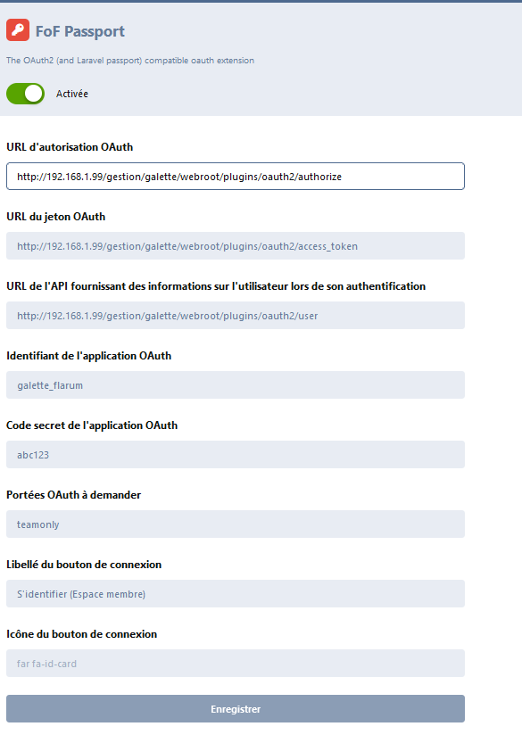
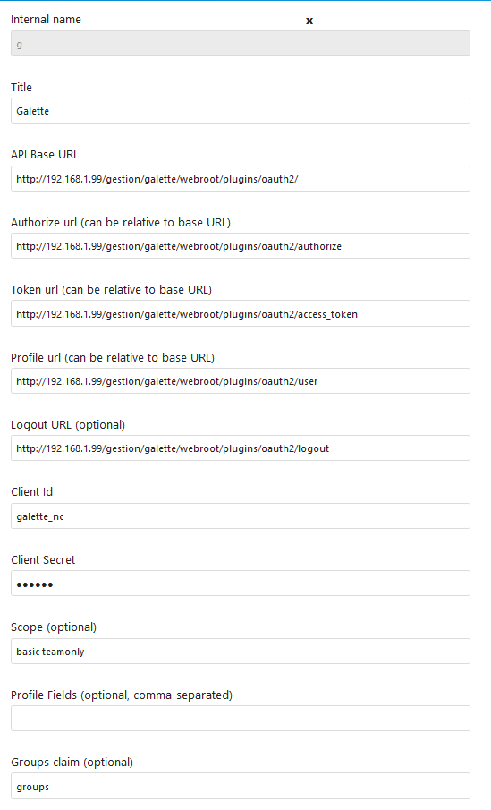

This plugins implements an [OpenID Connect](https://openid.net/connect/)
autorization server for [Galette](https://galette.eu). This allows registered
members in a Galette instance to log into third party websites, which implement
OpenID Connect or OAuth2 protocols, such as:

* [Flarum](https://flarum.org/),

* [Nextcould](https://nextcloud.com/),

* any path served by Apache, which may be protected using [mod_auth_openidc](https://github.com/zmartzone/mod_auth_openidc),

* and so on!

This plugin is mainly a derivative work from the great original [Galette OAuth2
plugin](https://github.com/galette-community/plugin-oauth2) written by Manuel
Hervouet.

# Setup

This project uses `league/oauth2-server`, `nl.idaas/openid-server`,
`symfony/yaml` and `hassankhan/config` packages.

To automatically download these packages:
```console
cd plugin-openidc
composer install
```

# Configuration

## Prepare public/private keys

```console
cd plugin-openidc/config
openssl genrsa -out private.key 2048
openssl rsa -in private.key -pubout -out public.key
chmod 660 *.key

```

## Configure a ClientEntity

Generate an encryption key, which will be used to encrypt tokens:
```console
vendor/bin/generate-defuse-key
```
This will result in an hexadecimal string.

Rename `config/config.yml.dist` to `config/config.yml` and edit according to your third party application settings:
```yaml
global:
    password: abc123
    encryption_key: def0123456789abcdef # put here the defused key generated above
galette_flarum:
    title: 'Forum Flarum'
    redirect_logout: 'http://192.168.1.99/flarum/public'
    options: teamonly
galette_nc:
    title: 'Nextcloud'
    redirect_logout: 'http://192.168.1.99/nextcloud'
    options: uptodate
galette_xxxxx:
```

Each third party client identifier must be prefixed by `galette_`, other prefixes will be rejected by the server.

The corresponding Flarum configuration:



The corresponding NextCloud configuration:




### Available options :
* teamonly : only staff members can login
* uptodate : only uptodate members can login

# Usage

## Nextcloud - how add groups for a specific member
Edit a member : In `info_adh` field you can add a line with `#GROUPS:group1;group2#`

Example :
```
#GROUPS:accouting;home#
```

# More information about OAuth2 Server
* https://oauth2.thephpleague.com/
* https://github.com/thephpleague/oauth2-server/
